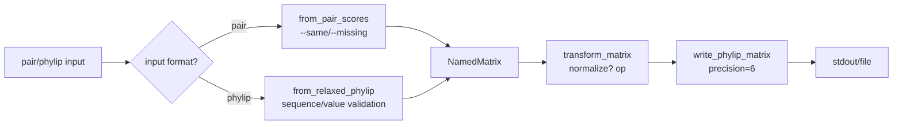

# necom mat

The `necom mat` module focuses on the manipulation and conversion of **distance matrices**. It is the upstream data preparation and preprocessing toolkit for `necom clust` (clustering and tree inference).

## Core Purpose

- **Input/Output**: Primarily handles **PHYLIP** format distance matrices (dense) and **Pairwise TSV** (sparse/list) format.
- **Functionality**: Format conversion, subset extraction, matrix comparison, and standardization.
- **Goal**: Provide standard, efficient data interfaces for phylogenetics and statistical clustering.

## Supported File Formats

`necom` currently focuses on clustering, distance matrix processing, and phylogenetic tree operations. Supported file formats are limited to those actually used by these commands.

| Format | Description | Command Docs |
| :--- | :--- | :--- |
| Distance | Distance matrix structures such as `PHYLIP` and `Pairwise` | [mat.md](mat.md), [clust.md](clust.md) |
| Newick | Phylogenetic tree format | [nwk.md](nwk.md) |

Distance matrices and Newick trees do not carry genomic coordinates. If other `necom` commands require coordinate-based input, this is documented separately in the corresponding command documentation.

## Supported Formats and Data Structures

`necom` uses three internal matrix structures for clustering and distance analysis, and supports two external distance matrix file formats: `PHYLIP` and `Pairwise`.

### 1. PHYLIP Distance Matrix (Dense)

The `PHYLIP` distance matrix format is a common format in phylogenetic analysis. `necom` provides a series of tools for processing this format in `src/cmd_necom/mat` and `src/libs/pairmat/`.

`necom` stores this internally using the `NamedMatrix` structure, backed by `CondensedMatrix` (a one-dimensional array storing the upper or lower triangle), with memory usage of approximately $O(N^2/2)$.

`necom` supports both Strict and Relaxed `PHYLIP` formats.

**Relaxed PHYLIP (default input support)**:
- First line: number of samples (usually required; if omitted, the program attempts to infer it automatically from the data rows).
- Data rows: sample name followed by distance values.
- Separators: whitespace characters (spaces or tabs).
- Matrix form: supports full square matrix or lower triangular matrix. The lower-triangular form may either include the diagonal (row `i` has `i+1` values) or omit it (row `i` has `i` values), in which case the diagonal is assumed to be `0.0`.
- Name length: not restricted.
- Note: if the first data row starts with a numeric token (e.g. `123`), it may be mistaken for the optional sequence-count header. Use non-numeric prefixes or omit the header line to avoid ambiguity.

**Strict PHYLIP (`strict` mode output)**:
- Follows the original `PHYLIP` standard.
- Sequence names: strictly truncated to 10 characters, left-aligned and space-padded.
- Numeric format: space-separated, usually kept to 6 decimal places.

Variants:
- **Full**: Standard $N \times N$ matrix including the redundant symmetric portion.
- **Lower-triangular**: Only the lower-triangle portion, reducing file size by half.

### 2. Pairwise TSV (Sparse/List Form)

The `Pairwise` format is a simple three-column TSV format for representing pairwise distances between sequences, commonly used as an intermediate format or input for graph data.

Sparse or list-form distance data, suitable for storing graph structures or only a subset of pairs.

- **Format**: tab-separated three columns: `name1\tname2\tdistance`
- **Characteristics**:
  - Suitable for sparse graphs or as an exchange format with other tools (e.g., BLAST/MMseqs2).
  - When converting to a matrix, unlisted pairs are treated as missing values or defaults.

`necom` provides mutual conversion between matrix and `Pairwise` list:
- **Matrix to Pair (`necom mat to-pair`)**: flatten a `PHYLIP` matrix into a `Pairwise` list.
- **Pair to Matrix (`necom mat to-phylip`)**: assemble a `Pairwise` list back into a `PHYLIP` matrix, supporting `--missing` and `--same` parameters.

### 3. Internal Matrix Structures

`necom` defines three core matrix structures in `src/libs/pairmat/`.

#### ScoringMatrix

- **Purpose**: sparse or on-demand scoring/distance matrix.
- **Underlying storage**: `HashMap<(usize, usize), T>`.
- **Characteristics**: sparse storage, only explicitly set values are kept; supports default values for diagonal and off-diagonal elements; logically symmetric (`get(i,j)` is equivalent to `get(j,i)`).

#### CondensedMatrix

- **Purpose**: efficient hierarchical clustering (e.g., `clust hier`) supporting larger-scale data.
- **Underlying storage**: `Vec<f32>`, only the upper triangle (excluding the diagonal) is stored, memory footprint is $N(N-1)/2$.
- **Index mapping**: for $(i, j)$ with $i < j$ → $k = N \cdot i - i(i+1)/2 + (j - i - 1)$.
- **Characteristics**: enforced symmetry, diagonal assumed to be 0, no name mapping stored, purely numerical computation.

#### NamedMatrix

- **Purpose**: dense distance matrix with row and column names (e.g., `PHYLIP` in-memory representation).
- **Underlying storage**: `IndexMap` (name index) + `CondensedMatrix` + optional diagonal vector.
- **Characteristics**: combined wrapper that accesses the underlying `CondensedMatrix` through name indexing; supports optional diagonal storage (required by `mat transform --normalize`); about 200MB when $N=10,000$.

## Subcommands in Detail

### Format Conversion

#### `necom mat to-phylip`

Convert pairwise TSV to a PHYLIP matrix.

- **Purpose**: Build a distance matrix from alignment results (e.g., `blast --outfmt 6`) for subsequent tree inference.
- **Output**: Full PHYLIP distance matrix. All observed IDs are collected into a square matrix.

#### `necom mat to-pair`

Convert a PHYLIP matrix to pairwise TSV.

- **Purpose**: Export a matrix as an edge list for graph clustering (e.g., `mcl`) or network visualization (Cytoscape).
- **Output**: Three-column TSV (`A B distance`). Lower-triangular output including the diagonal.

#### `necom mat format`

Convert between PHYLIP formats and normalize them.

- **Purpose**: Clean matrix formats to meet the requirements of specific software.
- **Modes (`--format`)**:
  - `full` (default): full matrix with long names preserved.
  - `lower`: lower-triangular matrix without diagonal values to save disk space.
  - `strict`: truncated names and fixed-width values for compatibility with the original PHYLIP toolkit.

### Operations and Analysis

#### `necom mat subset`

Extract a submatrix based on a list of names.

- **Purpose**: Extract specific species or gene families from a large matrix for fine-grained analysis.
- **Input**: PHYLIP matrix and an ID list file (one ID per line).
- **Output**: Full PHYLIP submatrix in the order of the ID list.

#### `necom mat compare`

Compute correlation or difference between two matrices.

- **Purpose**: Evaluate consistency between distance calculation methods, or information loss before and after clustering (Cophenetic Correlation).
- **Prerequisite**: Uses the intersection of common IDs between the two matrices.
- **Metrics (`--method`)**: Pearson, Spearman, Cosine, Jaccard, MAE, Euclidean, or `all`. Default is `pearson`; multiple methods can be comma-separated.

### `necom mat transform`

The `necom mat transform` command applies mathematical transformations to values in a matrix.

It is the core tool for converting a **Similarity Matrix** into a **Distance Matrix**, and also supports normalization and other numerical adjustments.

- **Purpose**: Convert similarity matrices to distance matrices, or perform normalization and log transformations.
- **Operations (`--op`)**: `linear`, `inv-linear`, `log`, `exp`, `square`, `sqrt`.
- **Normalization (`--normalize`)**: Normalize based on diagonal elements before applying the transformation.
- **Input**: PHYLIP distance matrix or pairwise TSV file; use `--input-format pair` for pairwise TSV.

Clustering algorithms (such as UPGMA, NJ, Ward) and multidimensional scaling (MDS) usually require a **Distance Matrix** or **Dissimilarity Matrix** that satisfies:

- $D(x, x) = 0$
- $D(x, y) \ge 0$
- Smaller $D(x, y)$ indicates higher similarity

However, upstream bioinformatics tools (such as BLAST, MMseqs2, Diamond) or statistical analyses usually output **Similarity**, which satisfies:

- $S(x, x) = Max$ (e.g., 1.0 or 100)
- Larger $S(x, y)$ indicates higher similarity

#### Conversion Models

`necom mat transform` supports the following common transformation modes:

##### 1. Linear Inversion

Applicable to similarities with a fixed upper bound (e.g., Identity, Percent Similarity).

$$D = Max - S$$

- **Scenario**: BLAST Identity (0–100) $\rightarrow$ $D = 100 - S$
- **Scenario**: Fraction (0–1) $\rightarrow$ $D = 1 - S$

##### 2. Normalized Linear Inversion

If $S$ has no fixed upper bound (e.g., Alignment Score), normalization is required first.

Raw scores are usually affected by sequence length and cannot be directly compared (e.g., a score of 1000 for a long sequence may be less significant than a score of 100 for a short sequence). Normalization uses the diagonal (self-alignment score) to convert raw scores into relative similarity (0–1 range), giving subsequent distance transformations (e.g., $1-S$) a meaningful mathematical interpretation.

$$D = 1 - \frac{S(x, y)}{\sqrt{S(x, x) \cdot S(y, y)}}$$

Or simply:

$$D = 1 - \frac{S(x, y)}{Max(S)}$$

##### 3. Logarithmic

Applicable to probabilities or multiplicative models (similar to Jukes-Cantor correction).

$$D = -\ln(S)$$

Or after normalization:

$$D = -\ln(\frac{S(x, y)}{\sqrt{S(x, x) \cdot S(y, y)}})$$

- **Scenario**: Sequence identity probability $\rightarrow$ evolutionary distance

#### Data Flow



#### Notes

- **Diagonal handling**:
  - When `necom` reads a matrix, it usually ignores the diagonal (sets it to 0), but the `transform` command attempts to preserve diagonal information to support `--normalize`.
  - If the input file lacks diagonal information (as in some PHYLIP variants), `--normalize` will not work correctly (treated as 0).
- **Numerical stability**:
  - The `log` operation is sensitive to 0 or negative values; off-diagonal values are set to `Inf` and diagonal values are set to 0.
  - If the diagonal is 0 during normalization, the result will be 0.

#### Future Work

The following transformations are not currently implemented but may be useful in the future:

- **Reciprocal**: $D = \frac{1}{S} - \frac{1}{Max}$. Can be approximated with `--op linear` plus an external script.
- **Cosine Similarity**: $D = 1 - \cos(\theta)$
- **Correlation**: $D = \sqrt{2(1 - r)}$ or $D = 1 - r$

For Cosine/Correlation distances, we recommend computing them in Python (SciPy) and exporting the result as a PHYLIP matrix.

## Recommended Workflows

### Scenario A: Tree Inference from BLAST Results

```bash
# 1. Parse BLAST results into pairwise distances (assuming distance = 1 - identity has already been computed)
# Note: ensure both A-B and B-A are present, or rely on a single direction
awk '{print $1, $2, 100-$3}' blast.out > pairs.tsv

# 2. Convert to PHYLIP matrix; set unaligned pairs to maximum distance 100
necom mat to-phylip pairs.tsv --missing 100 -o matrix.phy

# 3. Build NJ tree
necom clust nj matrix.phy > tree.nwk
```

### Scenario B: Extract Subset for Fine-Grained Analysis

```bash
# 1. Prepare a list of IDs of interest
cat interesting_ids.txt
# gene_A
# gene_B
# ...

# 2. Extract submatrix from a whole-genome distance matrix
necom mat subset genome_dist.phy interesting_ids.txt -o sub_matrix.phy

# 3. Analyze the subset with Ward clustering
necom clust hier sub_matrix.phy --method ward > sub_tree.nwk
```

### Scenario C: Evaluate Consistency Between Two Distance Calculation Methods

```bash
# Compare distance matrices based on K-mer (mash) and alignment (ani)
necom mat compare mash_dist.phy ani_dist.phy --method pearson,spearman

# Example output:
# Sequences in matrices: 100 and 100
# Common sequences: 100
# Method    Score
# pearson   0.985432
# spearman  0.971234
```

### Scenario D: Prepare Data for the Phylip Software Package

```bash
# Convert a long-name matrix to strict Phylip format
necom mat format modern.phy --format strict -o input.infile

# Then run neighbor (the original Phylip program)
neighbor < input.infile
```
