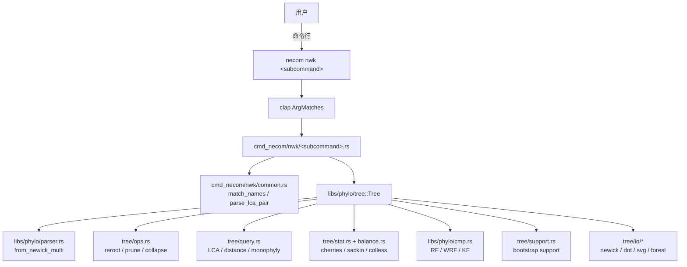
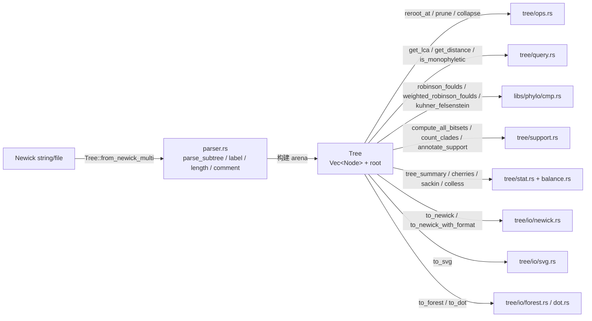

# 系统发育树处理 — libs/phylo 与 necom nwk

`necom nwk` 提供完整的 Newick 格式系统发育树处理功能，包括解析、操作、分析和可视化。

> **实现状态注记**：截至 2026-07-18，`necom nwk` 主体命令体系（stat/distance/indent/compare/comment/to-*/topo/label/reroot/prune/subtree/order/rename/replace/support）已实现；NHX 注释值对 Newick 结构字符（`:`、`=`、`;`、`,`、`]`、`\`）做完整转义以保证 round-trip；Forest/LaTeX 输出对 `dot`/`bar`/`rec`/`tri` 等可视化属性值也进行 LaTeX 特殊字符转义。`nwk condense`/`match`/`ed`/`gen`/`duration`、部分标准化统计指标（`colless_yule`/`pda`、`sackin_yule`/`pda`）以及 ASCII 树/随机树生成为规划中。
>
> **关联文档**：[nwk-eval.md](nwk-eval.md)（计划中的多维树评估框架，复用本文档描述的 `cmp.rs`/`stat.rs`/`is_monophyletic`）。

## 1. 架构设计

### 1.1 模块位置
```text
src/libs/phylo/
├── mod.rs              # 模块导出
├── node.rs             # 核心数据结构 (Node)
├── tree/               # Tree 结构体及子模块
│   ├── mod.rs          # Tree 结构体定义，委托各子模块
│   ├── io/             # 序列化/反序列化 (Newick, DOT, SVG, Forest)
│   ├── ops.rs          # 拓扑修改 (add_child, remove_node, reroot, prune, etc.)
│   ├── traversal.rs    # 遍历算法 (preorder, postorder, levelorder)
│   ├── query.rs        # 路径/距离/LCA 查询
│   ├── stat.rs         # 统计指标 (height, diameter, cherries, colless, sackin)
│   ├── balance.rs      # 平衡指标实现 (cherries, colless, sackin)；stat.rs 提供转发包装
│   ├── distance.rs     # 节点距离计算
│   ├── support.rs      # Bootstrap 支持率计算
│   ├── algo.rs         # 高级算法 (Sort, etc.)
│   └── tests.rs        # 内部集成测试
├── cmp.rs              # 树比较 (RF, WRF, KF 距离)
├── parser.rs           # Newick 解析器 (基于 Nom)
└── error.rs            # 错误定义 (TreeError)
```

### 1.2 核心数据结构

采用 **Arena (Vector-backed)** 模式：所有节点存储在 `Vec<Node>` 中，使用 `usize` 索引代替指针。

```rust
// src/libs/phylo/node.rs
pub type NodeId = usize;

pub struct Node {
    pub id: NodeId,
    pub parent: Option<NodeId>,
    pub children: Vec<NodeId>,
    pub name: Option<String>,
    pub length: Option<f64>,     // 分支长度
    pub properties: Option<BTreeMap<String, String>>, // NHX 注释 (key=value)
    pub deleted: bool,           // 软删除标记
}
```

```rust
// src/libs/phylo/tree/mod.rs
pub struct Tree {
    pub(super) nodes: Vec<Node>,   // Arena 存储
    pub(super) root: Option<NodeId>, // 根节点 ID
}
```

### 1.3 设计特点

*   **Arena 内存布局**: 节点紧凑存储在 `Vec` 中，缓存局部性好。
*   **索引引用**: 通过 `NodeId` (usize) 维护关系，避免 Rust 所有权问题。
*   **邻接表**: 每个节点直接持有 `Vec<NodeId>` 子节点列表，遍历快速。
*   **NHX 支持**: 注释解析为 `BTreeMap<String, String>`，原生支持 NHX 格式键值对。
*   **注释限制**: 普通 `[...]` 注释支持嵌套方括号与 `\]` 转义；首个未转义且未嵌套的 `]` 结束注释。NHX 注释 `[&&NHX:...]` 仍按原语法解析。`Tree::from_newick_multi` 在解析多树输入时，同样使用此扫描规则跳过顶层垃圾注释。
*   **分支长度规范化**: `Node::finite_length()` 将 `NaN`、正负无穷、负值与缺失长度统一视为 `0.0`；输出时 `0.0` 与缺失长度均被省略。`stat` 仅把正有限长度计为 "有长度" 边，`distance` 仅在分支长度之和绝对值超过 `1e-9` 时使用加权距离，否则回退到拓扑边数。`format_float` 对绝对值小于或等于 `0.5e-6` 的非零值回退到科学计数法，避免在 6 位小数下被静默舍入为零；其余值保留 6 位小数并去除末尾零。
*   **确定性输出**: 使用 `BTreeMap` 而非 `HashMap`，保证序列化输出顺序固定。
*   **按需计算**: 不缓存中间状态（深度、距离等），按需计算以保持轻量。
    *   `Tree::len()` 每次遍历 `nodes` 统计非 `deleted` 节点，为 O(n)；频繁调用时需注意开销。
*   **软删除与 Compact**: `remove_node` 等操作仅标记 `deleted=true`（软删除），物理回收由 `compact()` 完成。`algo::prune_nodes` 在清理拓扑后会自动调用 `compact()`，因此返回后所有外部持有的 `NodeId` 均失效。

### 1.4 数据流与调用链





---

## 2. 树比较核心概念

在规划高级分析功能（如距离计算、拓扑比较）之前，有必要明确以下系统发育树比较的核心概念：

### 2.1 基础积木：划分

**Splits** 是描述无根树拓扑结构的最基本单元。
*   **定义**: 树上的每一条**内部边**（Edge）都将所有叶子节点（Taxa）划分成两个互不相交的集合 $\{A, B\}$。这种划分被称为一个 Split，通常记作 $A|B$。
*   **性质**: 一棵树的拓扑结构可以**完全**由它所包含的所有 Splits 集合来定义。
*   **实现**: 在计算机中通常使用 **BitSet** 高效存储。例如叶子为 $\{A,B,C,D\}$，则 Split $\{A,B\}|\{C,D\}$ 可表示为 `1100`。

### 2.2 Robinson-Foulds (RF) 距离

**RF 距离** 是基于 Splits 的最经典距离度量。
*   **计算公式**: $RF = |S_1 \setminus S_2| + |S_2 \setminus S_1|$。即两棵树中**不共享**的 Splits 总数（对称差）。
*   **特点**: **极度敏感**（"全有或全无"指标），但**计算极快**（线性复杂度 $O(n)$）。
*   **适用场景**: 快速检查树的完全一致性，或作为基础的差异度量。

### 2.3 Triplet Distance (三元组距离)

**Triplet** 是**有根树 (Rooted Trees)** 的最小信息单元。
*   **定义**: 任意三个叶子 $\{x, y, z\}$ 在有根树中的拓扑关系。例如 $((x,y),z)$ 表示 $x,y$ 更亲缘。
*   **特点**: **仅限有根树**。比 RF 更**鲁棒**（High Resolution）。**tqDist** (Sand et al. 2014) 提供了针对一般多叉树 (General Trees) 的 $O(n \log n)$ 高效算法。

### 2.4 Quartet Distance (四元组距离)

**Quartet** 是**无根树 (Unrooted Trees)** 的最小信息单元。
*   **定义**: 任意四个叶子 $\{a, b, c, d\}$ 在无根树中的拓扑关系。四者只有三种可能的二分拓扑：$ab|cd$，$ac|bd$，$ad|bc$。
*   **特点**: **最强鲁棒性**。目前公认衡量无根树相似度的最佳指标之一。但**计算复杂**（**tqDist** 算法实现了针对多叉树的 $O(d \cdot n \log n)$ 复杂度，解决了传统算法仅限二叉树或耗时 $O(n^2)$ 的问题）。

### 2.5 Quartet Sampling (QS)

**QS** (Pease et al. 2018) 是一种现代的**分支支持度评估**方法，用于替代或补充传统的 Bootstrap。
*   **核心思想**: 传统 Bootstrap 只能给出"支持频率"，而 QS 利用 Quartet 的拓扑分布来区分**冲突 (Conflict)** 和 **信号缺失 (Lack of Signal)**。
*   **指标体系**:
    *   **QC (Quartet Concordance)**: 一致性 $[-1, 1]$。类似于 Bootstrap，越高越好。
    *   **QD (Quartet Differential)**: 偏向性 $[0, 1]$。衡量两种错误拓扑是否均匀分布。若 QD 接近 0，暗示存在特定方向的系统性冲突（如渐渗）。
    *   **QI (Quartet Informativeness)**: 信息量 $[0, 1]$。衡量有多少 Quartet 是有信息量的（非星状）。
*   **优势**: 能够深入剖析低支持率的成因（是数据太乱还是数据太少）。

### 2.6 概念对比总结

| 概念 | 适用对象 | 核心逻辑 | 敏感度 | 计算复杂度 | 比喻 |
| :--- | :--- | :--- | :--- | :--- | :--- |
| **Splits** | 无根/有根 | **边** (Edge) 的存在性 | - | - | 树的骨架 |
| **RF** | 无根/有根 | **数不同的边** | 极高 (脆弱) | 低 $O(n)$ | 严格考官：错一题扣大分 |
| **Triplets**| **有根树** | **数不同的三人组** | 中等 (鲁棒) | 中 $O(n \log n)$ | 民主投票：看三人小组意见 |
| **Quartets**| **无根树** | **数不同的四人组** | 中等 (鲁棒) | 高 $O(n \log n)$ | 民主投票：看四人小组意见 |

---

## 3. CLI 功能映射（newick_utils → necom）

以下列出 `newick_utils` 工具到 `necom nwk` 子命令的映射：

*   **`nw_stats`** $\to$ **`necom nwk stat`**
    *   **功能**: 树的统计信息 (节点数, 深度, 类型等)
    *   **状态**: **已实现** (支持多树处理, TSV/KV 输出, 统计二叉分枝)

*   **`nw_distance`** $\to$ **`necom nwk distance`**
    *   **功能**: 计算节点间距离 / 树间距离
    *   **状态**: **已实现** (支持 root, parent, pairwise, lca, phylip)

*   **`nw_indent`** $\to$ **`necom nwk indent`**
    *   **功能**: 格式化/缩进 Newick 树
    *   **状态**: **已实现** (支持紧凑/缩进输出)

*   **`necom nwk compare`**
    *   **功能**: 比较树 (RF, WRF, KF 距离)
    *   **状态**: **已实现** (支持单文件内两两比较, 双文件比较; 单文件仅含 1 棵树时发出警告并仅输出表头)

*   **`necom nwk comment`**
    *   **功能**: 添加 NHX 注释 (color, dot, bar, rec, tri 等)
    *   **状态**: **已实现** (支持按名称/LCA 选择节点, 移除注释)

*   **`nw_display`** $\to$ **`necom nwk to-dot` / `to-forest` / `to-svg` / `to-tex`**
    *   **功能**: 树的可视化 (Graphviz/LaTeX Forest/SVG)
    *   **状态**: **已实现** (支持 Graphviz DOT, LaTeX Forest 代码及完整文档导出, SVG 矢量图)

*   **`nw_topology`** $\to$ **`necom nwk topo`**
    *   **功能**: 仅保留拓扑结构 (去除分支长度)
    *   **状态**: **已实现** (支持 `--bl`, `--comment`, `-I`, `-L`)

*   **`nw_labels`** $\to$ **`necom nwk label`**
    *   **功能**: 提取所有标签 (叶子/内部节点)
    *   **状态**: **已实现** (支持正则过滤, 内部/叶子筛选, 单行输出)

*   **`nw_reroot`** $\to$ **`necom nwk reroot`**
    *   **功能**: 重定根 (Outgroup, Midpoint)
    *   **状态**: **已实现** (支持 Midpoint, Outgroup (LCA), Lax mode, Deroot)

*   **`nw_prune`** $\to$ **`necom nwk prune`**
    *   **功能**: 剪枝 (移除指定节点)
    *   **状态**: **已实现** (支持正则/列表，自动清理，反选)

*   **`nw_clade`** $\to$ **`necom nwk subtree`**
    *   **功能**: 提取子树 (Clade)
    *   **状态**: **已实现** (支持 context 扩展、单系群检查、正则匹配)

*   **`nw_order`** $\to$ **`necom nwk order`**
    *   **功能**: 节点排序 (Ladderize)
    *   **状态**: **已实现** (支持 alphanumeric/descendants/list/deladderize)

*   **`nw_rename`** $\to$ **`necom nwk rename` / `replace`**
    *   **功能**: 重命名节点 (Map file/Rule)
    *   **状态**: **已实现** (Split into `rename` & `replace`)

*   **`nw_condense`** $\to$ **`necom nwk subtree --condense`**
    *   **功能**: 压缩树 (合并短枝/多叉化)
    *   **状态**: **仅通过 `subtree --condense` 提供；无计划实现独立 `condense` 子命令**

*   **`nw_support`** $\to$ **`necom nwk support`**
    *   **功能**: 计算/显示支持率 (Bootstrap)
    *   **状态**: **已实现** (支持 target + replicates 输入, `--percent` 输出整数百分比并截断至零)

*   **`nw_match`** $\to$ **`necom nwk match`**
    *   **功能**: 匹配两棵树的节点
    *   **状态**: 未实现

*   **`nw_ed`** $\to$ **`necom nwk ed`**
    *   **功能**: 编辑距离 / 树操作脚本
    *   **状态**: 未实现

*   **`nw_gen`** $\to$ **`necom nwk gen`**
    *   **功能**: 生成随机树
    *   **状态**: 未实现

*   **`nw_duration`** $\to$ **`necom nwk duration`**
    *   **功能**: (通常指时间树相关)
    *   **状态**: 未实现

---

## 4. API 参考（necom::phylo）

以下列出 `necom::phylo` 库提供的公开 API。

### 已实现

*   **树结构**:
    *   `Tree::new()`: 创建空树。
    *   `Tree::add_node()`, `Tree::add_child()`: 构建树结构。
    *   `Tree::get_node()`, `Tree::get_root()`: 访问节点。
    *   `Tree::len()`: 节点总数（每次 O(n) 统计非软删除节点）。
*   **解析**:
    *   `Tree::from_newick()`: 解析 Newick 字符串 (支持引号、注释、科学计数法)。
    *   `Tree::from_file()`: 从文件读取并解析 Newick。
*   **序列化**:
    *   `to_newick()`: 紧凑格式输出。
    *   `to_newick_with_format()`: 支持缩进的格式化输出。
    *   `to_newick_subtree()`: 序列化指定子树。
    *   `to_dot()` (Graphviz): 输出 DOT 格式。
    *   `to_svg()`: 输出 SVG 矢量图格式。
    *   `to_forest()`: 输出 LaTeX Forest 代码 (自由函数，通过 `io::to_forest()` 调用)。
*   **遍历**:
    *   `preorder`, `postorder`: 深度优先遍历，返回 `Vec<NodeId>`。
    *   `levelorder`: 广度优先遍历，返回 `Vec<NodeId>`。
*   **查询**:
    *   `get_leaves()`: 获取所有叶子节点。
    *   `get_path_from_root()`: 获取根到节点的路径。
    *   `get_common_ancestor()` (LCA): 最近公共祖先。
    *   `get_distance()`: 计算节点间距离 (加权/拓扑)。
    *   `node_distance()`: 计算节点间距离；分支长度之和绝对值超过 `1e-9` 时使用加权距离，否则回退到拓扑边数。
    *   `get_subtree()`: 获取子树节点集合。
    *   `find_nodes()`, `get_node_by_name()`: 查找节点。
    *   按名查找以第一次出现为准；存在重复节点名时，`get_node_by_name` 返回第一个匹配，`get_name_id`/`BTreeMap`  likewise 记录第一个匹配的 ID。
*   `get_height()`: 计算节点高度 (到最远叶子的距离)。
    *   `is_monophyletic()`: 判断是否为单系群（数学定义：空集返回 false，单个节点返回 true）。
    *   `is_clade()`: 判断是否为演化支；要求至少两个节点且构成单系群。
*   **修改**:
    *   `reroot_at()`: 重新定根 (支持边长重分配)。
    *   `prune_where()`: 剪枝 (删除匹配节点及其子孙)。
    *   `algo::prune_nodes()`: 批量删除节点并清理后续产生的叶子内部节点与 degree-2 节点；返回前自动 `compact()`，外部 `NodeId` 失效。
    *   `remove_node()`: 软删除单个节点。
    *   `collapse_node()`: 压缩节点 (合并边长)。
    *   `compact()`: 物理删除软删除节点并重构树；调用后所有外部持有的 `NodeId` 均失效。

### 统计与计算

*   `is_binary()`: 检查是否为二叉树。
*   `get_leaf_names()`: 获取所有叶子节点的名称列表。
*   `get_splits()`: 获取树的二分 (Bipartitions/Splits) 集合，是计算 RF 距离的基础。
*   `diameter()`: 树的直径 (最远叶子间距离)。
*   `robinson_foulds()`: 计算两棵树的 Robinson-Foulds 距离 (拓扑差异)。
*   `weighted_robinson_foulds()`: 加权 RF 距离。
*   `kuhner_felsenstein()`: Kuhner-Felsenstein 距离。
*   `cherries()` (自由函数，`balance.rs`/`stat.rs`): 计算 Cherry 数量。
*   `colless()` (自由函数，`balance.rs`/`stat.rs`): Colless 平衡指数。
*   `sackin()` (自由函数，`balance.rs`/`stat.rs`): Sackin 平衡指数。

### 未实现

*   **统计指标标准化**:
    *   `colless_yule()`, `colless_pda()`: Colless 指数的标准化版本。
    *   `sackin_yule()`, `sackin_pda()`: Sackin 指数的标准化版本。
*   **遍历**:
    *   `inorder`: 中序遍历 (仅适用于二叉树，`necom` 支持多叉树故未直接实现)。

### 计划中

*   **可视化**:
    *   `print_entity()` (或类似): 在终端打印 ASCII 树状图，用于快速调试和展示。
*   **树生成**:
    *   `generate_random_tree()` (Yule/Coalescent 模型): 主要用于模拟研究。优先级较低。

---

## 5. 可视化详情

`necom` 的可视化功能支持三种输出格式：SVG（浏览器直接查看）、LaTeX Forest（出版级质量）、Graphviz DOT（通用图形工具）。

### 5.1 SVG 输出

*   **`necom nwk to-svg`**: 生成 SVG 矢量图，无需外部依赖，浏览器直接打开。

**特点**：
*   自动检测模式：有枝长时绘制 phylogram（含比例尺），无枝长时绘制 cladogram。
*   默认样式与 LaTeX Forest 模板一致：灰色分支线 (1pt)、黑色节点圆点 (2pt)、无衬线字体。
*   支持自定义宽度 (`-w`) 和叶节点间距 (`-v`)。
*   Phylogram 模式下自动绘制比例尺（1×/2×/5× 动态刻度算法）。

### 5.2 LaTeX Forest 输出

`necom` 的可视化功能深度集成了 LaTeX Forest 包，配合精心设计的模板 (`src/assets/template.tex`)，能够生成出版级质量的进化树。

#### 核心命令

*   **`necom nwk to-forest`**: 生成原始 Forest 代码。适合嵌入现有 LaTeX 文档。
*   **`necom nwk to-tex`**: 生成完整 `.tex` 文档。自动合并模板，可直接用 `xelatex` 编译。

#### 样式系统

模板定义了四种核心样式，可以通过 Newick 文件中的 NHX 注释直接调用：

1.  **`dot` (节点圆点)**
    *   **效果**: 在节点处绘制实心圆点。
    *   **用法**: `[&&NHX:dot=red]` (指定颜色) 或自动应用于带名称的内部节点。

2.  **`bar` (垂直短杠)**
    *   **效果**: 在父节点与子节点的连线上绘制垂直短杠，常用于标记性状演化或事件。
    *   **用法**: `[&&NHX:bar=blue]`。

3.  **`rec` (背景矩形)**
    *   **效果**: 为整个子树（Clade）绘制背景矩形框。利用 `fit to=tree` 实现。
    *   **用法**: `[&&NHX:rec=LemonChiffon]`。常配合模板中定义的柔和色系使用。

4.  **`tri` (三角形)**
    *   **效果**: 在节点右侧绘制三角形，常用于表示折叠的子树 (Collapsed Clade) 或强调叶节点。
    *   **用法**: `[&&NHX:tri=green]`。

#### 颜色与全局设置

*   **配色方案**: 模板内置了一组柔和的莫兰迪色系（如 `ChampagnePink`, `TeaRose`, `Celadon` 等）。
*   **自动对齐**: 默认启用 `tier=word`，强制所有叶节点对齐（Cladogram 风格）。
*   **字体支持**:
    *   **默认**: 使用 `Noto Sans` 系列（需安装），兼容性好。
    *   **高级 (`--no-default-style`)**: 保留模板中预设的 `Fira Sans` (英) 和 `Source Han Sans SC` (中) 设置，适合需要特定设计感的场景。

#### 高级特性

*   **Phylogram 模式 (`--bl`)**:
    *   绘制带分支长度的系统发育树。
    *   **自动比例尺**: 程序会根据树高自动计算合适的比例尺（如 0.01, 0.05, 1.0 等），并绘制在右下角。
*   **Forest 直通车 (`--forest`)**:
    *   允许将外部生成的 Forest 代码文件（非 Newick）直接嵌入模板生成 PDF。
*   **特殊字符处理**:
    *   Newick 名称中的下划线 `_` 会被自动转换为空格，避免 LaTeX 编译错误。
    *   节点名、label、comment 以及可视化属性 `dot`/`bar`/`rec`/`tri` 中的 LaTeX 特殊字符（`{ } \ # $ % & ~ ^`）会被自动转义，防止破坏 Forest 语法或导致编译失败。

#### 工作流示例

1.  **准备数据**: 使用 `necom nwk comment` 命令或是手动为节点添加样式注释。
    ```bash
    # 为节点 A 和 B 的最近公共祖先 (LCA) 添加背景矩形和标签
    necom nwk comment input.nwk --lca A,B --rec TeaRose --label Group1 > annotated.nwk
    ```
2.  **转换**:
    ```bash
    necom nwk to-tex annotated.nwk > output.tex
    ```
3.  **编译**:
    ```bash
    tectonic output.tex
    ```

---

## 6. 使用示例

### necom nwk stat

统计 Newick 文件的基本信息（节点数、叶子数、二分歧节点数等）。

```bash
# 默认输出 (Key-Value 格式)
necom nwk stat data.nwk

# 表格输出 (TSV 格式，适合后续处理)
necom nwk stat data.nwk --style line
```

### necom nwk indent

格式化 Newick 树，使其更易读，或压缩为单行。

```bash
# 默认缩进 (2个空格)
necom nwk indent data.nwk

# 自定义缩进字符 (例如使用4个空格)
necom nwk indent data.nwk --text "    "

# 压缩为单行 (Compact)
necom nwk indent data.nwk --compact
```

---

## 7. 附录：工作流参考

### Bootscan Workflow (`bootscan.sh`)

`newick_utils` 源码中的 `bootscan.sh` 展示了一个结合多种生物信息学工具进行重组检测的完整流程。这为 `necom` 的 CLI 设计提供了实际应用场景参考。

**流程步骤详解：**

1.  **序列比对 (Alignment)**
    *   **工具**: `mafft`
    *   **操作**: 对输入的未比对序列文件（FASTA）进行多序列比对。
    *   **命令**: `mafft --quiet "$INFILE" > "$MUSCLE_OUT"`

2.  **切片 (Slicing)**
    *   **工具**: `infoalign`, `seqret` (EMBOSS 工具集)
    *   **操作**:
        *   获取比对长度 (`infoalign`).
        *   按指定步长 (`SLICE_STEP`) 和窗口大小 (`SLICE_WIDTH`) 遍历比对结果。
        *   将每个窗口切片并转换为 PHYLIP 格式 (`seqret`).
    *   **目的**: 准备滑动窗口数据以构建局部树。

3.  **构建系统发育树 (Tree Building)**
    *   **工具**: `phyml`
    *   **操作**: 对每个 PHYLIP 切片文件构建最大似然树 (Maximum Likelihood Tree)。
    *   **参数**: `-b 0` (无 bootstrap，求速度), `-o n` (不优化拓扑/分支/率参数)。
    *   **输出**: 生成一系列无根树文件。

4.  **重定根 (Rerooting)**
    *   **工具**: `nw_reroot` (Newick Utilities)
    *   **操作**: 使用指定的外群 (`OUTGROUP`) 对每棵树进行定根。
    *   **命令**: `nw_reroot $unrooted_tree $OUTGROUP > ${unrooted_tree/.txt/.rr.nw}`
    *   **对应 necom**: `necom nwk reroot`

5.  **距离提取 (Distance Extraction)**
    *   **工具**: `nw_distance`, `nw_clade`, `nw_labels`
    *   **操作**:
        *   计算参考序列 (`REFERENCE`) 到树中其他所有节点的距离 (`nw_distance -n`).
        *   提取相关标签 (`nw_clade`, `nw_labels`).
        *   生成包含 `(Position, Distance1, Distance2, ...)` 的表格数据。
    *   **对应 necom**: `necom nwk distance`, `necom nwk subtree`, `necom nwk label`

6.  **可视化 (Visualization)**
    *   **工具**: `gnuplot`
    *   **操作**: 将距离表格绘制成折线图。横轴为序列位置，纵轴为参考序列到其他序列的遗传距离。
    *   **原理**: 如果参考序列在某个区域与其他序列的距离显著变化（例如最近邻改变），提示可能发生了重组事件。
